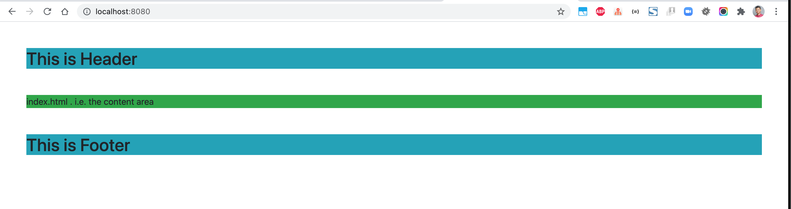
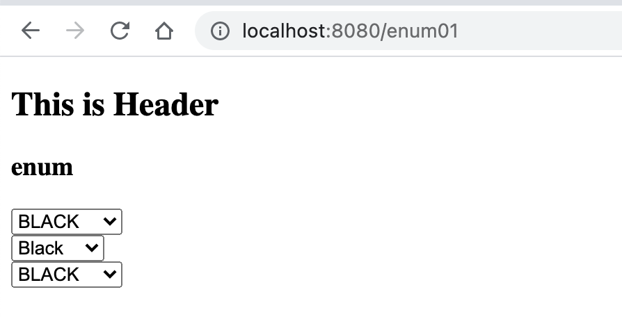
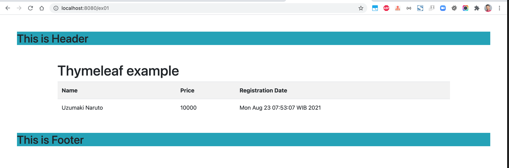
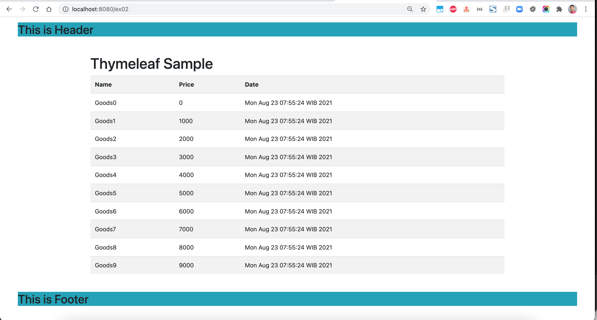
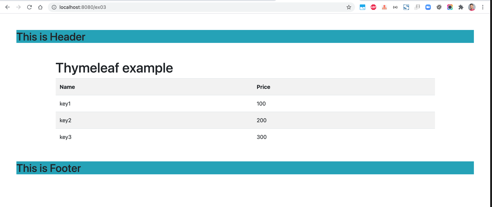
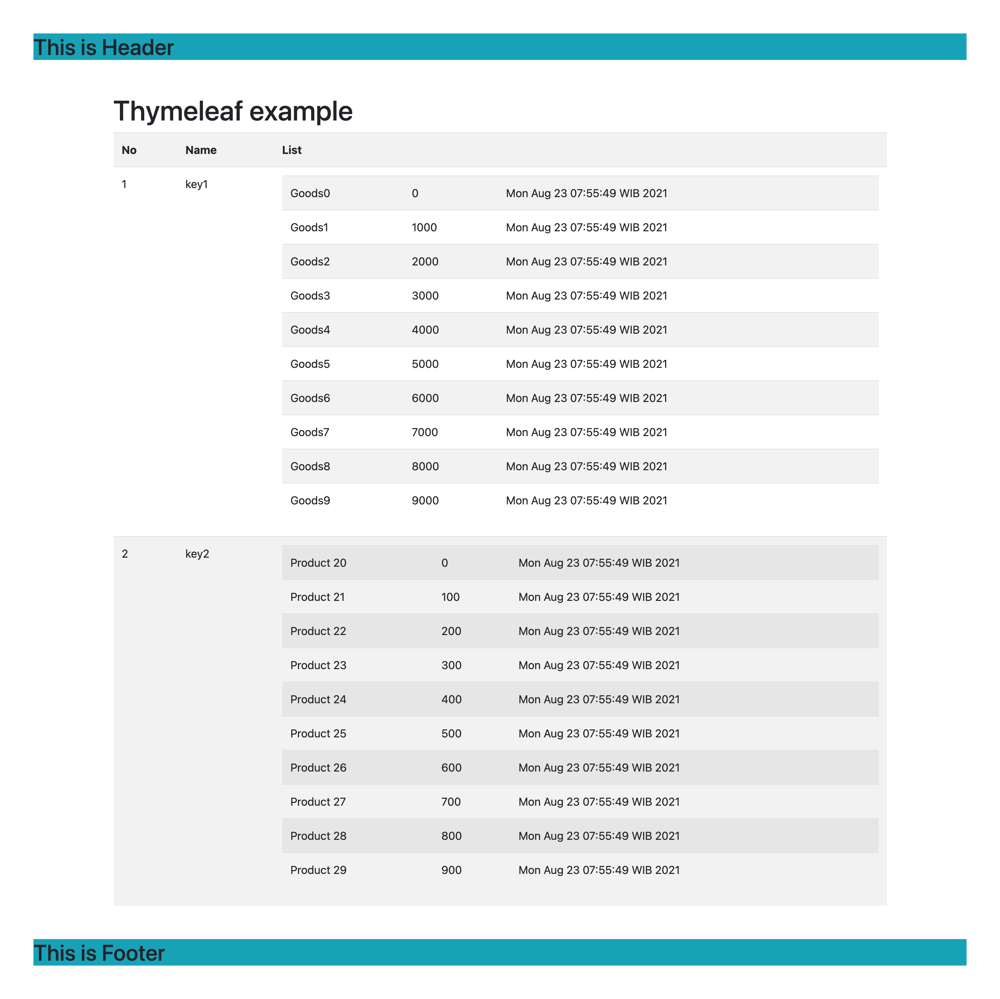
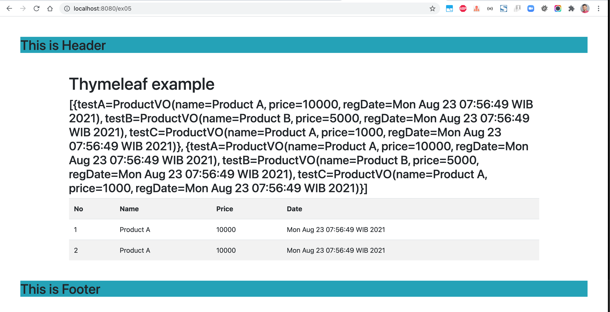

# springboot-thymeleaf-demo
### Things todo list:
1. Clone this repository: `git clone https://github.com/hendisantika/springboot-thymeleaf-demo.git`
2. Navigate to the folder: `cd springboot-thymeleaf-demo`
3. Run the application: `mvn clean spring-boot:run`
4. Open your favorite browser: http://localhost:8080/

### Images Screenshot

Header Page

Enum Page

Example 01 Page

Example 02 Page

Example 03 Page

Example 04 Page

Example 05 Page

 "Example 05 Page"
